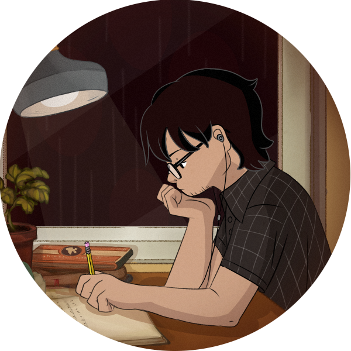

## Greetings 👋

<em>I'm a Software Enginneer at Federal University of Campina Grande, Brazil. Currently working with <strong>Natural Language Processing</strong> and <strong>Voice Analytics</strong>. Passionate about gaming, art, reading and fitness.</em>

 

 

## About me
- 📌 Live in Campina Grande, PB 🇧🇷
- 🎓 MSc. in Computer Science
- 🎓 Bachelor in computer science
- 📖 Currently Learning: Spring, Elixir & Game Dev.
- 🤖 Currently working with NLP and voice analytics
- 🐧 Professional Linux Distro Hopper (I currently use Arch btw)

## Languages
- Native Portuguese 🇧🇷
- Somewhat Fluent English 🇺🇸
- Beginner Spanish 🇪🇸

## Programming Languages and Tools
</img>
</img>
</img>
</img>
</img>
 
</img>
</img>
 
</img>
</img>
 
</img>
</img>
</img>

## 📈 GitHub Stats

 

 

  

